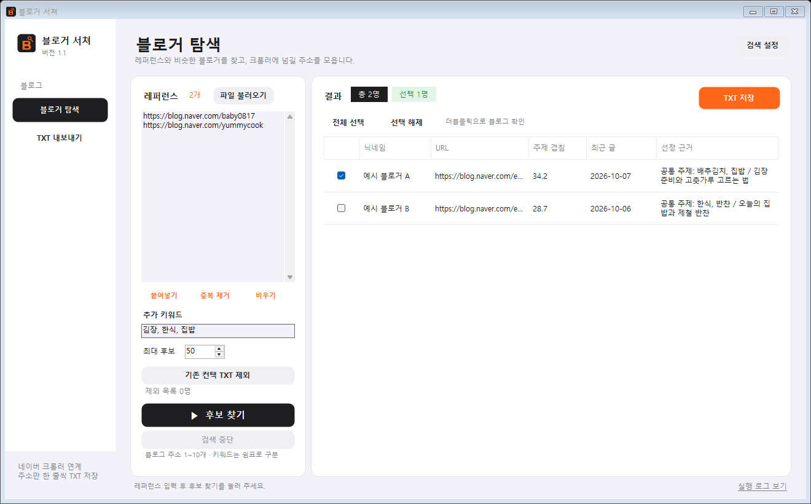

# 블로거 서쳐 1.1

네이버 크롤러의 연계 앱입니다. 레퍼런스 블로그의 최근 공개 글을 바탕으로 비슷한 주제의 후보를 찾고, 선택한 블로그 주소를 TXT로 저장합니다.



## 실행

Windows 64비트에서 `블로거서쳐.exe`를 실행합니다. .NET Framework 4.8 이상을 권장합니다.

1. 레퍼런스 네이버 블로그 주소 1~10개를 입력하거나 TXT 파일을 불러옵니다.
2. 추가 키워드를 쉼표로 구분해 입력합니다. 비워두면 최근 글 제목에서 검색어를 만듭니다.
3. 기존 컨택 목록이 있으면 `기존 컨택 TXT 제외`로 불러옵니다.
4. `후보 찾기`를 누르고 결과를 확인합니다. 블로그는 더블클릭으로 열 수 있습니다.
5. 원하는 후보를 체크한 뒤 `TXT 저장`을 누릅니다.
6. 네이버 크롤러의 **블로그 정보 → 파일 불러오기**에 저장한 TXT를 넣어 지표를 수집하고 엑셀로 내보냅니다.

TXT는 UTF-8 BOM 형식이며 헤더 없이 블로그 홈 주소만 한 줄씩 저장됩니다. 중복 주소는 제거됩니다.

```text
https://blog.naver.com/example_a
https://blog.naver.com/example_b
```

## 후보 선정

최근 공개 RSS 글 제목 최대 25개의 단어 빈도를 비교해 주제 겹침 점수를 계산합니다. 광고 적합성, 블로그 지수, 방문자 수를 뜻하는 점수는 아닙니다. 레퍼런스 본인과 제외 목록은 결과에서 빠집니다. 최근 글을 확인하지 못한 후보도 제외하므로 목표 수보다 적게 나올 수 있습니다.

기본 검색은 로그인 없이 공개 네이버 웹 검색을 사용합니다. 화면 변경이나 접근 제한에 영향을 받을 수 있습니다. 선택적으로 `검색 설정`에 네이버 검색 API의 Client ID와 Client Secret을 입력하면 공식 API를 사용합니다. 키는 파일에 저장하지 않습니다. 실행 내역은 `실행 로그 보기`에서 확인합니다.

## 빌드와 검증

Windows PowerShell에서 다음 명령으로 빌드합니다. 별도 NuGet 패키지는 필요하지 않습니다.

```powershell
powershell -ExecutionPolicy Bypass -File .\build.ps1
```

오프라인 검증은 주소 정규화, TXT 중복 제거와 저장 형식, 도메인 검증, 주제 비교, RSS 및 검색 파서, 폼 생성을 확인합니다.

```powershell
New-Item -ItemType Directory -Force tests | Out-Null
Start-Process -FilePath '.\블로거서쳐.exe' -ArgumentList '--self-test','tests\self-test.txt' -Wait
Get-Content .\tests\self-test.txt
```

`--live-test`는 실제 공개 RSS와 검색 연결을, `--pipeline-test`는 후보 검색부터 제외·정렬까지 확인합니다. 두 검증은 인터넷 연결과 네이버의 응답 상태에 의존합니다. `--preview`는 예시 데이터를 넣은 화면 PNG를 만듭니다. 각 옵션 뒤에 결과 파일 경로를 지정합니다.

`src/BlogSearcher.cs`에 앱과 검증 코드가 있습니다. `src/UiConstructor.txt`는 화면 생성 코드 원본이며, 화면을 편집한 뒤 `python src/apply_layout.py`를 실행하면 C# 생성자에 반영됩니다. Python은 화면 개발 보조 작업에만 사용하며 일반 실행·빌드에는 필요하지 않습니다.

기존 크롤러는 저장소 루트에서 별도로 유지됩니다. 이 앱의 소스와 실행 파일은 이 폴더에서 관리합니다.
