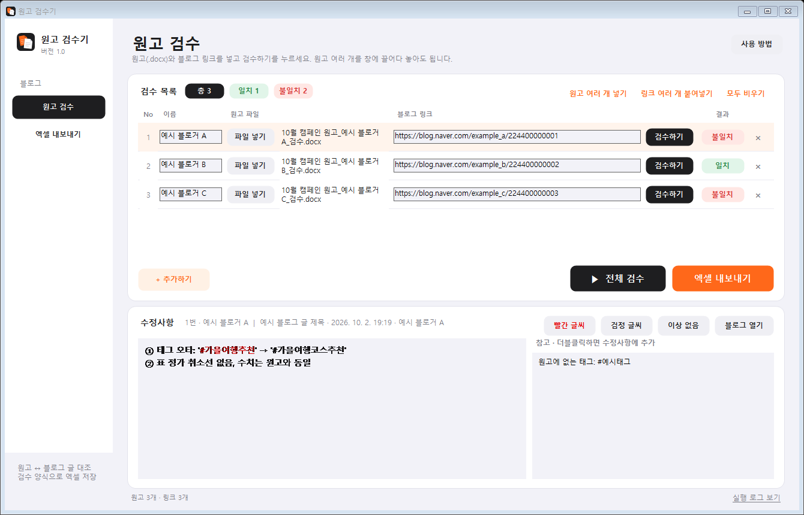

# 원고 검수기 1.0

블로그 원고(.docx)와 실제 게시된 네이버 블로그 글을 대조하는 앱입니다. 원고에 표시한 수정 사항이 글에 반영됐는지 확인하고, 검수 결과를 엑셀로 저장합니다.



## 실행

Windows에서 `원고검수기.exe`를 실행합니다. 따로 설치할 것은 없고, .NET Framework 4.5 이상이면 됩니다. Windows 10·11에는 기본으로 들어 있습니다.

1. `파일 넣기`로 원고(.docx)를 넣습니다. 원고를 창에 끌어다 놓아도 되고, 여러 개를 한 번에 넣으면 행이 자동으로 늘어납니다. 이름은 파일 이름 끝의 닉네임으로 채워집니다. 예: `…원고_스팟프로모션_닉네임_검수.docx`
2. 블로그 글 링크를 넣습니다. 링크 여러 줄을 복사해 링크 칸에 붙여넣으면 아래 행으로 나눠 들어갑니다.
3. `검수하기`(한 행) 또는 `전체 검수`를 누르면 결과가 `일치` 또는 `불일치`로 나옵니다.
4. 아래 `수정사항`에서 문구를 고칠 수 있습니다. 글자를 드래그해 `빨간 글씨`로 바꾸면 엑셀에서도 빨간색입니다. 오른쪽 `참고`에는 확실하지 않은 차이가 나오고, 더블클릭하면 수정사항에 추가됩니다.
5. `엑셀 내보내기`를 누르면 게시일별 시트에 저장됩니다. 예: 시트 `26.10.2`, B2부터 `순서 | 이름 | URL | 수정사항`. 수정사항이 있는 행은 이름 칸이 빨간색으로 칠해집니다.

## 원고에서 읽는 표시

| 원고 표시 | 확인 내용 |
|---|---|
| 빨간 취소선 | 지울 부분이 글에 남아 있으면 `삭제 미반영` |
| 노란 형광펜 | 수정한 문구가 글에 없으면 `수정 미반영` 또는 `오타 수정 미반영` |
| 하늘색 형광펜·빨간 안내문(※…) | 검수 메모로 봅니다. 글에 그대로 남아 있으면 지적합니다 |
| 표 안 검정 취소선 | 정가 취소선입니다. 블로그 표에 취소선이 없으면 지적합니다 |
| 워드 변경 내용 추적 | 삭제·추가 기록도 같은 방식으로 확인합니다 |

함께 확인하는 항목은 다음과 같습니다.

- 링크: 원고의 링크가 글에 있는지, 주소 끝에 공백이 붙어 클릭하면 오류가 나는지
- 태그: 원고 태그가 빠졌거나 오타가 났는지. 블로그 태그는 네이버 태그 목록에서 가져옵니다
- 표: 블로그에 글자 표로 들어간 경우만 숫자(금액·데이터 등)와 취소선을 비교합니다. 이미지로 넣은 표는 `확인 바람`만 표시합니다
- 깨진 글자: `à`처럼 화살표가 깨진 곳
- 같은 단어가 두 번 연속으로 나온 곳

광고 고지 문구, 사진 개수는 비교하지 않습니다. 보통 이미지로 넣기 때문입니다.

## 빌드와 검증

Windows PowerShell에서 다음 명령으로 빌드합니다. Windows에 들어 있는 C# 컴파일러를 쓰므로 별도 설치가 필요 없습니다.

```powershell
powershell -ExecutionPolicy Bypass -File .\build.ps1
```

`src/app.ico`가 없으면 앱이 먼저 아이콘을 그린 뒤 다시 빌드합니다.

```powershell
.\원고검수기.exe --self-test tests\self-test.txt      # 오프라인 검증
.\원고검수기.exe --check 원고.docx <블로그 링크> 결과.txt   # 한 건 대조
.\원고검수기.exe --batch 원고폴더 HTML폴더 결과.txt 결과.xlsx  # 저장한 글 HTML로 한꺼번에 대조
.\원고검수기.exe --preview docs\preview.png           # 예시 데이터로 화면 PNG
```

`src/WongoChecker.cs`에 앱 전체 코드가 있습니다.
